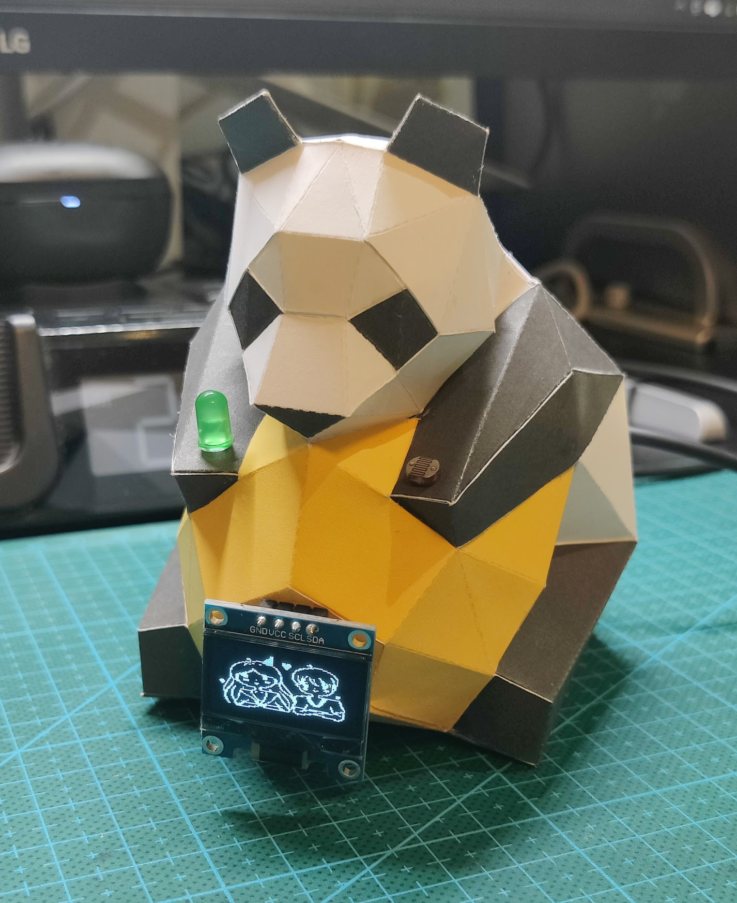
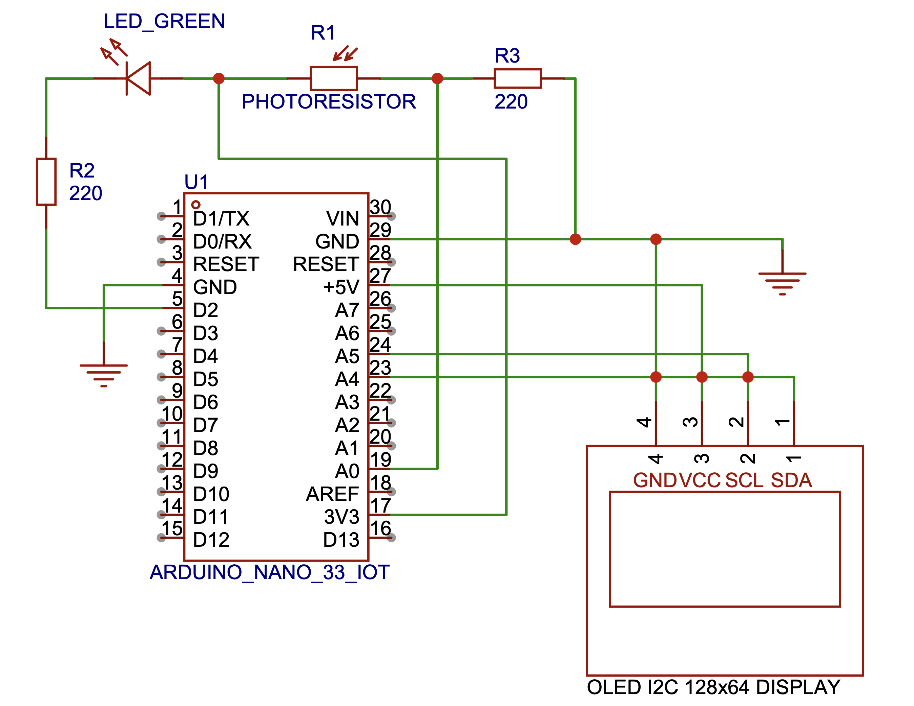
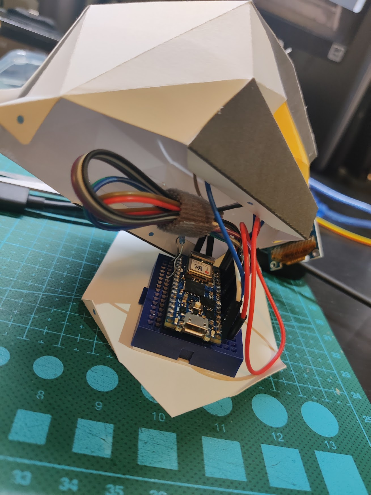
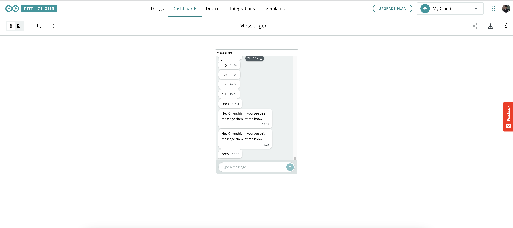
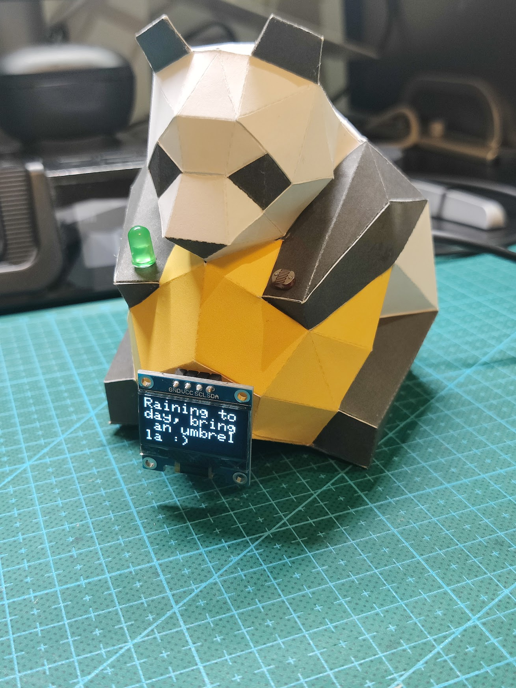

# Arduino IoT Panada Messenger 
## Overview

A physical messenger device that can receive the message from the Arduino IoT cloud by connecting to the local networ

## Components

- Arduino Nano 33 IoT 
- Green LED 
- Photoresistor 
- 0.96'' I2C OLED LCD Display 128x64 Pixel

## Schematic

## Assembly

## How It Works

1. Connect the device to the local internet then re-upload the program using over-air update function from Arduino IoT Cloud 
2. Go to the cloud, you can view and send the messages through the messenger widget

3. If the message was sent to the device prior to the restart, the screen will display !message; else it will display an opening image to indicate no message received

4. Once the message was sent, you can cover the photoresistor to indicate that the message has been read (the LED will be turn and the opening image will be displayed after 10 seconds)
5. You can check if the message was read or not by checking the messenger widget 

\*You can view the video for demonstration in this respiratory

